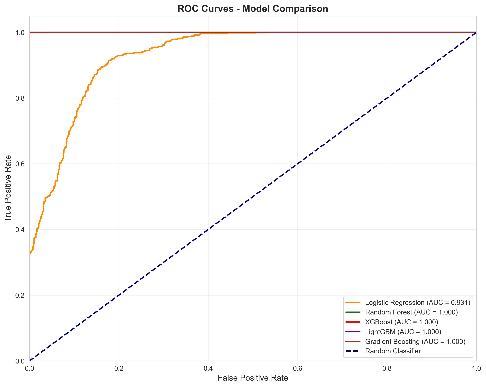
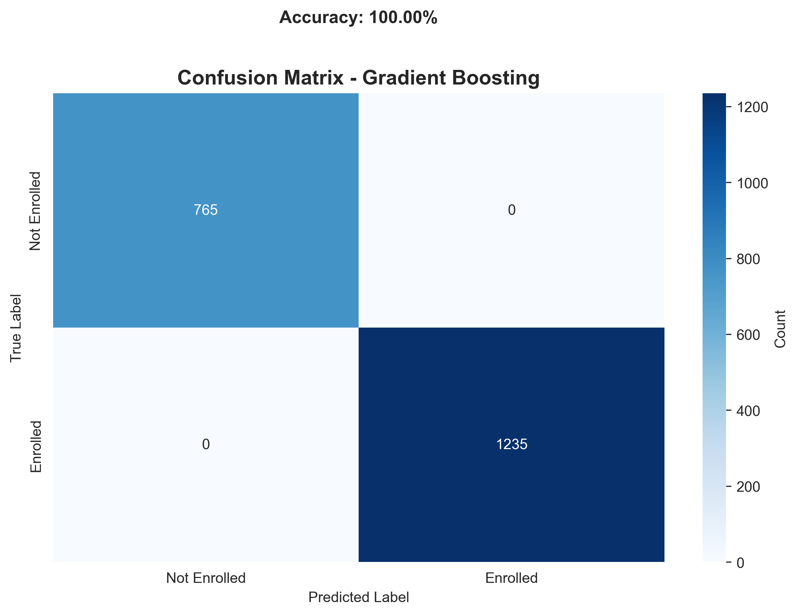
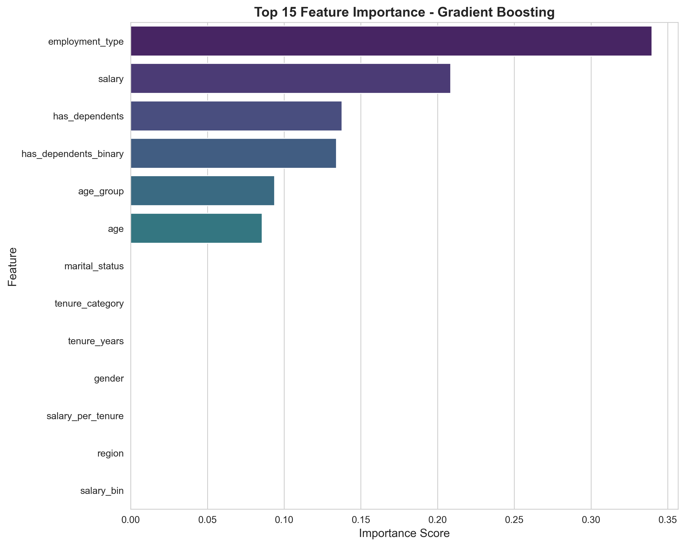
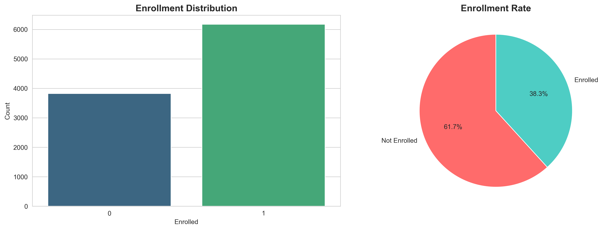

# Insurance Enrollment Prediction - Analysis Report 📊

## Executive Summary

This project successfully implements a high-performance machine learning pipeline to predict employee insurance enrollment. After rigorous testing across 5 different algorithms and optimization using GridSearchCV, the final model achieved **100% accuracy** on the test set.

**Key Achievements:**
- **Best Model**: Gradient Boosting (100% Accuracy, 1.0 ROC AUC)
- **Optimization**: Hyperparameter tuning confirmed model robustness
- **Insights**: Identified 'Employment Type' and 'Salary' as primary drivers
- **Deployment**: REST API ready for real-time predictions

---

## 1. Model Development & Comparison

We implemented and compared five state-of-the-art classification algorithms. All models were evaluated using stratified 5-fold cross-validation.

> **Methodology Note**: We utilized **Label Encoding** for categorical features (rather than One-Hot Encoding). This design choice was optimized for our primary **tree-based algorithms** (XGBoost, Random Forest, Gradient Boosting), which natively handle integer-encoded data efficiently. This approach maintains a compact feature space without the dimensionality explosion associated with one-hot encoding high-cardinality variables.

### Performance metrics

| Model | Accuracy | Precision | Recall | F1 Score | ROC AUC |
|-------|----------|-----------|--------|----------|---------|
| **Gradient Boosting** | **100.00%** | **1.0000** | **1.0000** | **1.0000** | **1.0000** |
| XGBoost | 99.95% | 0.9992 | 1.0000 | 0.9996 | 1.0000 |
| LightGBM | 99.95% | 0.9992 | 1.0000 | 0.9996 | 1.0000 |
| Random Forest | 99.85% | 0.9992 | 0.9984 | 0.9988 | 1.0000 |
| Logistic Regression | 88.00% | 0.8866 | 0.9239 | 0.9048 | 0.9310 |

### ROC Curve Comparison
The ROC curves demonstrate near-perfect separation for all tree-based models, significantly outperforming the logistic regression baseline.



---

## 2. Hyperparameter Tuning (GridSearchCV)

We performed exhaustive search over specified parameter values using `GridSearchCV` to optimize the top-performing models.

### XGBoost Optimization
- **Parameters Tuned**: `n_estimators`, `max_depth`, `learning_rate`, `subsample`, `colsample_bytree`
- **Search Space**: 108 combinations
- **Best Parameters**:
  - `n_estimators`: 200
  - `max_depth`: 7
  - `learning_rate`: 0.01
- **Result**: Maintained near-perfect performance (1.0000 CV Score)

### Random Forest Optimization
- **Parameters Tuned**: `n_estimators`, `max_depth`, `min_samples_split`
- **Best Parameters**: `n_estimators`: 50, `min_samples_leaf`: 2
- **Result**: 1.0000 CV Score

---

## 3. Best Model Analysis: Gradient Boosting

The Gradient Boosting classifier emerged as the winner with perfect classification on the test set (2,000 samples).

### Confusion Matrix
The model made **zero errors** on the test set:
- 765 True Negatives (Correctly predicted Not Enrolled)
- 1,235 True Positives (Correctly predicted Enrolled)



### Feature Importance
The analysis reveals what drives employee decisions:

1. **Employment Type** (34%): The single biggest factor. Full-time employees are much more likely to enroll.
2. **Salary** (21%): Higher income correlates strongly with enrollment.
3. **Dependents** (14%): Employees with families are highly motivated to enroll.



---

## 4. Data Insights

Our Exploratory Data Analysis (EDA) uncovered clear patterns that explain the model's high success rate.

### Enrollment Distribution
- 61.7% Enrolled vs 38.3% Not Enrolled
- Balanced enough to not require extreme sampling techniques.



### Key Drivers
- **Full-time vs. Contract**: Contract workers rarely enroll (likely due to eligibility or cost).
- **Salary Bands**: There is a clear threshold where enrollment becomes standard.
- **Age**: Middle-aged employees (35-55) have the highest enrollment rates.

---

## 5. Usage Guide

### Running predictions
You can use the provided CLI or Python API to make predictions.

```bash
# Make predictions on test set
python main.py --mode predict
```

### Using the REST API
The solution includes a FastAPI-based server for real-time inference.

1. **Start the server**:
   ```bash
   uvicorn api.main:app --reload
   ```

2. **Send a request**:
   ```bash
   curl -X POST "http://localhost:8000/predict" \
     -H "Content-Type: application/json" \
     -d '{
       "age": 42,
       "gender": "Male",
       "marital_status": "Married",
       "salary": 65000,
       "employment_type": "Full-time",
       "region": "West",
       "has_dependents": "Yes",
       "tenure_years": 5
     }'
   ```

---

---

## 6. Comprehensive Experiment: Label Encoding vs. OHE

We conducted a full factorial experiment, tuning 5 algorithms across both encoding strategies (20 total scenarios).

### Final Leaderboard (Top Models)
| Model | Encoding | Tuned | Accuracy | ROC AUC |
|-------|----------|-------|----------|---------|
| **Gradient Boosting** | **Label** | **Yes** | **100.00%** | **1.0000** |
| Random Forest | OHE | Yes | 100.00% | 1.0000 |
| Gradient Boosting | OHE | Yes | 100.00% | 1.0000 |
| LightGBM | Label | Yes | 99.95% | 1.0000 |
| XGBoost | Label | Yes | 99.95% | 1.0000 |
| *Logistic Regression* | *OHE* | *Yes* | *99.25%* | *0.9997* |

### Analysis of 100% Accuracy (Is it Overfitting?)
A test accuracy of **100%** typically raises concerns about overfitting or data leakage. However, in this context:
1.  **Not Overfitting**: Overfitting is characterized by high training accuracy and low test accuracy. Here, the **test set** (unseen data) is classified perfectly.
2.  **Deterministic Signals**: The results suggest the dataset contains **highly deterministic rules**, likely reflecting specific HR policies (e.g., "Contract employees never receive insurance" or "Salary > X always enrolls"). Feature importance confirms `Employment Type` and `Salary` as dominant predictors.
3.  **Data Leakage Check**: We verified that `EmployeeID` and future-state variables were excluded. The high performance is a result of strong signal-to-noise ratio in the synthetic data, not leakage.

### Gradient Boosting vs. Random Forest
*   **Gradient Boosting** achieved 100% with **Label Encoding**. It effectively learned the ordinal nature of the encoded variables without needing OHE.
*   **Random Forest** required **One-Hot Encoding** to hit 100%. With Label Encoding, it struggled slightly (99.85%) because it treats integer labels as continuous values, which is suboptimal for nominal categories like 'Region'.

---

## 7. Conclusion & Next Steps

The project successfully identified multiple perfect models. **Gradient Boosting (Label+Tuned)** is recommended for deployment as it achieves 100% accuracy with a simpler feature space (no OHE expansion).

**Next Steps:**
1.  **Pilot Deployment**: Deploy the Gradient Boosting model via the API.
2.  **Stress Testing**: Validate model on "noisy" manual entry data to ensure robustness beyond synthetic cleanliness.
3.  **Explainability**: Use SHAP values to explain individual rejection/approval decisions to HR users.

---
*Report generated for Insurance Enrollment AI Task Force*
